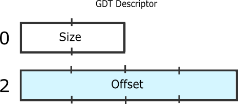

# GDT Global Descriptor Table

## Reference 
https://wiki.osdev.org/Global_Descriptor_Table

## Definition
GDT is specific to the IA32 architecture. It contains entries telling the CPU about **memory segments**.

## Assembly instruction
```
LGDT gdt
```
where gdt is the head address of the self-define GDT.

## Structure

### GDT Descriptor
It expects the location of a GDT description structure:



The **offset** is the linear address of the table itself, which means that paging applies.

The **size** is the size of the table subtracted by 1.
描述GDT的大小。

This is because the maximum value of size is 65535, while the GDT can be up to 65536 bytes (a maximum of 8192 entries). Further no GDT can have a size of 0.

### GDT Entry


