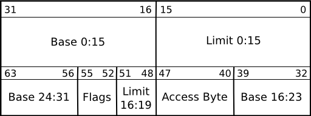

# GDT Global Descriptor Table

## Reference 
https://wiki.osdev.org/Global_Descriptor_Table

## Definition
GDT is specific to the IA32 architecture. It contains entries telling the CPU about **memory segments**.

## Assembly instruction
```
LGDT gdt
```
where gdt is the head address of the self-define GDT.

## Structure

### GDT Descriptor
It expects the location of a GDT description structure:


The **offset** is the linear address of the table itself, which means that paging applies.

The **size** is the size of the table subtracted by 1.
描述GDT的大小。

This is because the maximum value of size is 65535, while the GDT can be up to 65536 bytes (a maximum of 8192 entries). Further no GDT can have a size of 0.

### GDT Entry



The base is a 32 bit value containing the linear address where the segment begins. 

base占用了16:31, 32:39, 56:63,一共32位。

The limit, a 20 bit value, tells the maximum addressable unit (either in 1 byte units, or in pages).

limit占用了0:15, 48:51,一共20位。

Hence, if you choose page granularity (4 KiB) and set the limit value to 0xFFFFF the segment will span the full 4 GiB address space.

$4KB \times FFFFF = 2^{32} = 4GB$


Access Byte:
- Pr: Present bit. This must be 1 for all valid selectors.
- Privl: Privilege, 2 bits. Contains the ring level, 0 = highest (kernel), 3 = lowest (user applications).
- S: Descriptor type. This bit should be set for code or data segments and should be cleared for system segments (eg. a Task State Segment)
- Ex: Executable bit. If 1 code in this segment can be executed, ie. a code selector. If 0 it is a data selector.
- DC: Direction bit/Conforming bit.
Direction bit for data selectors: Tells the direction. 0 the segment grows up. 1 the segment grows down, ie. the offset has to be greater than the limit.
- Conforming bit for code selectors:
    - If 1 code in this segment can be executed from an equal or lower privilege level. For example, code in ring 3 can far-jump to conforming code in a ring 2 segment. The privl-bits represent the highest privilege level that is allowed to execute the segment. For example, code in ring 0 cannot far-jump to a conforming code segment with privl==0x2, while code in ring 2 and 3 can. Note that the privilege level remains the same, ie. a far-jump form ring 3 to a privl==2-segment remains in ring 3 after the jump.
    - If 0 code in this segment can only be executed from the ring set in privl.
- RW: Readable bit/Writable bit.
Readable bit for code selectors: Whether read access for this segment is allowed. Write access is never allowed for code segments.
Writable bit for data selectors: Whether write access for this segment is allowed. Read access is always allowed for data segments.
- Ac: Accessed bit. Just set to 0. The CPU sets this to 1 when the segment is accessed.
- Gr: Granularity bit. If 0 the limit is in 1 B blocks (byte granularity), if 1 the limit is in 4 KiB blocks (page granularity).
- Sz: Size bit. If 0 the selector defines 16 bit protected mode. If 1 it defines 32 bit protected mode. You can have both 16 bit and 32 bit selectors at once.

## Intel 64 and IA-32 Architectures Software Developer's Manual
### Volume 3 --- System Programming Guide
#### Chapter 3 --- Protected-Mode Memory Management

## Segmentation and Paging
The memory management facilities of the IA-32 architecture are divided into two parts: segmentation and paging. 

Segmentation provides a mechanism of isolating individual code, data, and stack modules so that multiple programs (or tasks) can run on the same processor without interfering with one another. 

分段机制把不同程序的代码分离，在程序内部，把代码段，数据段和栈分离，达到同一个处理器运行不同程序，程序之间互不干扰的效果。

Paging provides a mechanism for implementing a conventional demand-paged, virtual-memory system where sections of a program’s execution environment are mapped into physical memory as needed.

分页机制提供了从虚拟内存到物理内存的映射机制。

保护模式下，必然会有分段机制，但是分页机制是可选的。


## Segment Selector

Requested Privilege Level (RPL)(Bits 0 and 1) — Specifies the privilege level of the selector. The privilege level can range from 0 to 3, with 0 being the most privileged level. See Section 5.5, “Privilege Levels”, for a description of the relationship of the RPL to the CPL of the executing program (or task) and the descriptor privilege level (DPL) of the descriptor the segment selector points to.

## Segment Register


Every segment register has a “visible” part and a “hidden” part. (The hidden part is sometimes referred to as a “descriptor cache” or a “shadow register.”) When a segment selector is loaded into the visible part of a segment register, the processor also loads the hidden part of the segment register with the base address, segment limit, and access control information from the segment descriptor pointed to by the segment selector.

### 有了这些预备知识，看看逻辑地址Logical Address，怎么翻译成Linear Address
举个例子，SS:SP的翻译。
1. SS有16位是可以使用的，13位Index，1位GDT/LDT选择符，2位权限位（先假设我们使用GDT）；
2. SS利用Index在GDT中，找到第index个Entry，把Entry中描述的Base Address和SP(作为offset)直接相加得到32位的Linear Address；
3. 利用Entry的Base+Limit来检查是否超出访问范围。
4. 利用Entry的Access Bytes检查是否有访问权限。

## GDT and LDT(Local Descriptor Tables)


## Overview

