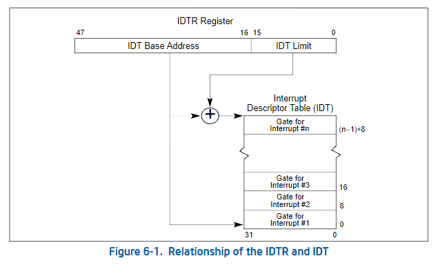
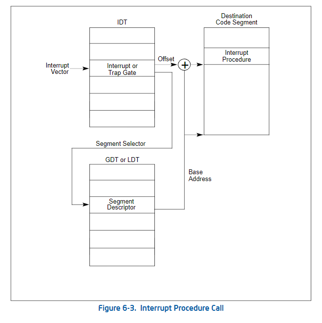

# Interrupt Descriptor Table (IDT)

Dependencies: PIT->PIC->IDT->GDT

## Reference
https://wiki.osdev.org/Interrupt_Descriptor_Table

## Overview

## Software interrupts in x86
https://wiki.osdev.org/Exceptions

### Exceptions
#### Faults
These can be corrected and the program may continue as if nothing happened.
- Example: Divide-by-zero Error, Page-Fault
#### Traps
Traps are reported immediately after the execution of the trapping instruction.
- Example: Breakpoints.
#### Abort
Some severe unrecoverable error.

### User-defined
- Generated by INT instruction: Defined by the OS or the firmware (eg: BIOS)
- Maskable 可以被CPU屏蔽

## Hardware interrupts
### IRQs: An external device requires CPU's attention.
- Examples: System Timer (IRQ-0), Keyboard interrupt
- Maskable 可以被CPU屏蔽

## When does the CPU receive interrupt？
- Interrupts are enable in EFLAGS Register.
  - We can modify it by **cli** or **sti** or **popf** instructions
- There is a pending IRQ signal or the INT instruction is issued
- There is a valid **Interrupt Descriptor** entry corresponding to the interrupt number:
  - An interrupt descriptor tells the CPU what to do (Where to jump in the code)
  - Interrupt descriptor are defined by
    - The Interrupt Vector Table (IVT) in **Real-mode** (remember the BIOS calls?)
    - The Interrupt Descriptor Table (IDT) in **Protected-mode**

## What does the CPU do?

Before excecuting the next instruction, CPU will check if there is an interrupt. If so,
- Retrieve the Interrupt/Exception number.
-  Pushes the following information on the stack.
- Disables the interrupts.
- Jumps to the code location
specified in the corresponding interrupt descriptor.

Otherwise, carries on with the
execution of the next
instruction.

## Interrupt Service Routines
- A function that CPU calls upon reception of an interrupt
- The content pushed on top the stack depends on
    - Type of the interrupt/exception (whether there’s an error code or not)
    - The privilege (ring of protection) of the current running code vs. the ISR
    - So, the calling convention is different from that of a C function
    - Different Prologue and Epiloge
    - The ISR returns using **iret instead of ret**
    - Pops everything pushed to the stack as a result of an interrupt except the error code.
    - Can re-enable the interrupts by popping the old flags register.
    - If your ISR is handling an exception with an error-code you should pop it yourself before issuing iret.
    - No other register is saved. So, what if you call a C function from an ISR?
- Can be written in C or assembly. Look here!

## IRS in assembly

## IDT Entry

### Test IDT
1. Cause an exception:
   - E.g. Divide-By-Zero
   - Define an ISR that prints something on the screen.
   - After initializing IDT, perform a division by zero and see if the ISR kicks in.
2. INT instruction:
    - Using inline assembly, issue an INT instruction in your code after IDT is setup.
    - Make the corresponding ISR print something on the screen.

## PIT (Programmable Interval Timer)

## PIC 

